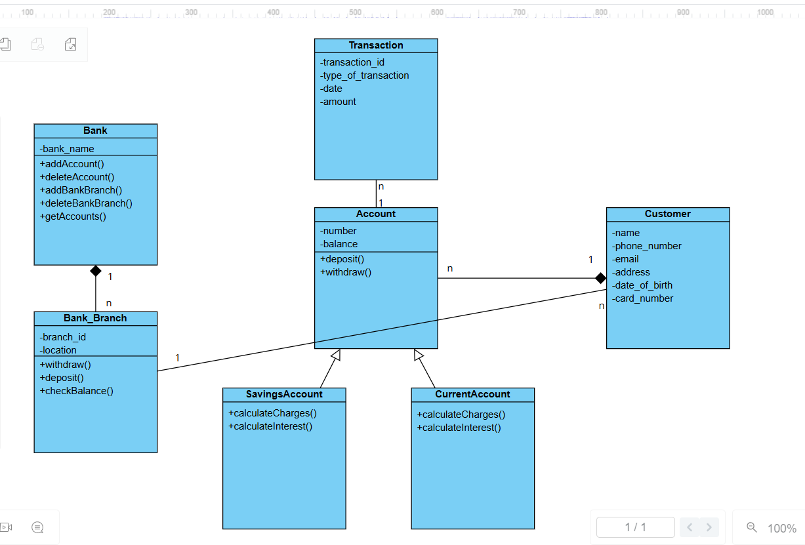
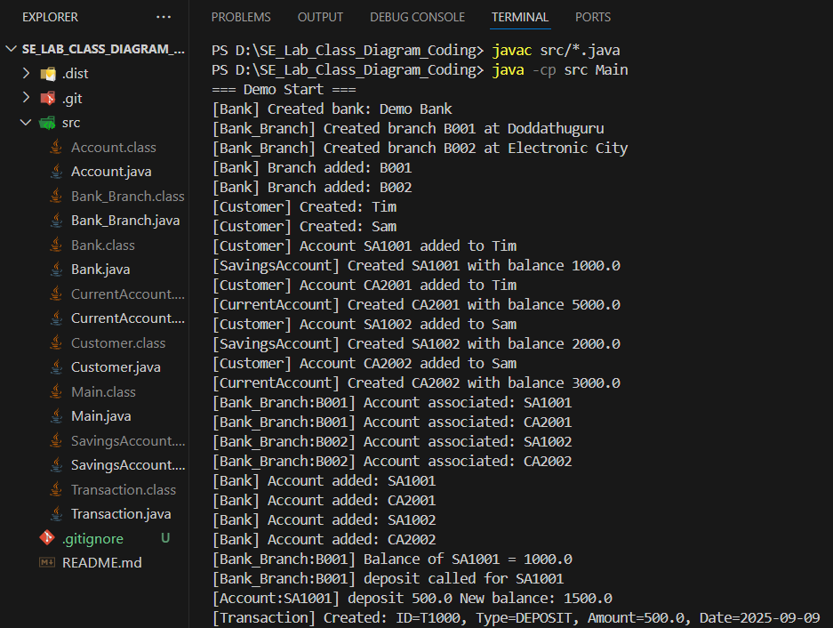
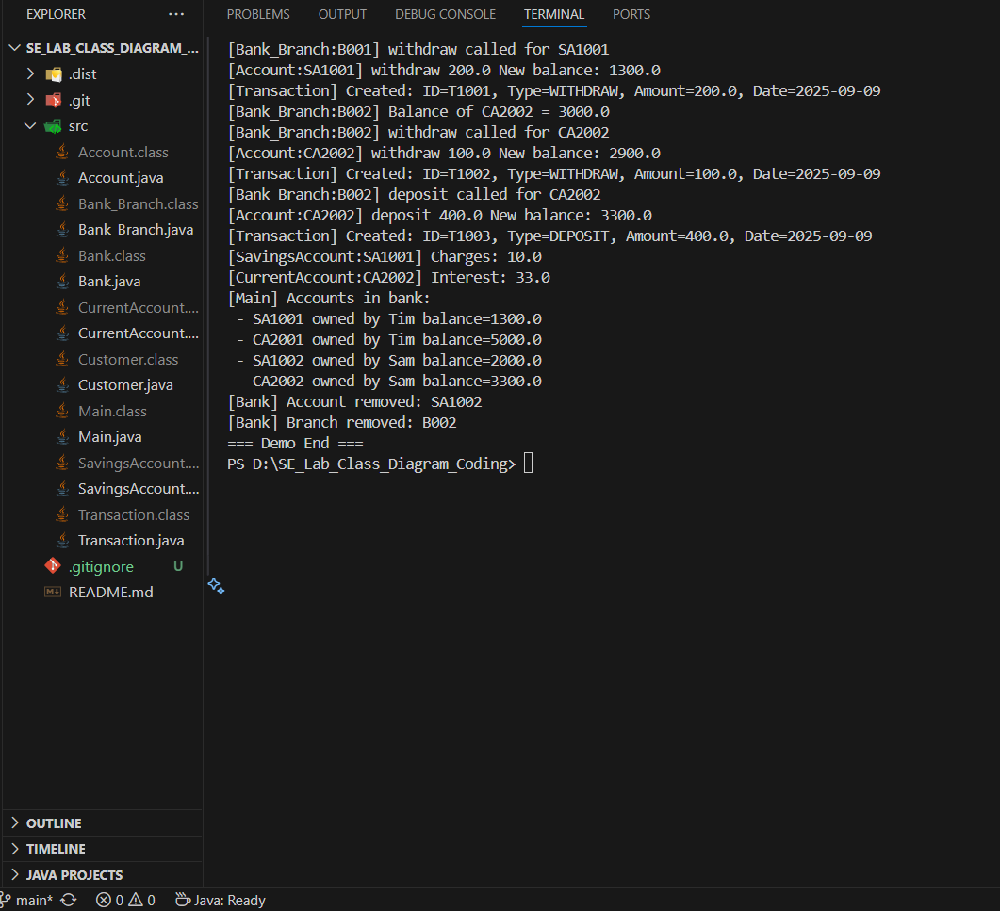

# SE_Lab_Class_Diagram_Coding
Translation of the class diagram submitted in the Lab into code. A simple banking system built in Java to demonstrate OOP concepts and UML class diagram implementation.
     
## Class Diagram
 

## Requirements
- Java JDK 8 or above
- Git (to clone the repository)

## How to Get the Project
- Clone the repository to your local machine using Git
- Navigate into the project directory:
```bash
cd SE_Lab_Class_Diagram_Coding
```

## How to Compile
Open terminal in the **SE_Lab_Class_Diagram_Coding/** directory and run:
```bash
javac src/*.java
```

## How to Run
After compiling, run:
```bash
java -cp src Main
```

## Demo Actions

The demo (**Main.java**) performs the following:

- Creates a bank with two branches
- Creates two customers
- Each customer has both a savings and a current account
- Performs deposits, withdrawals, and balance checks
- Calculates charges and interest for accounts
- Adds a manual transaction
- Lists all accounts in the bank
- Deletes an account and a branch
- All logs are printed to the terminal

## Output
Here are sample outputs of the program: 
 

